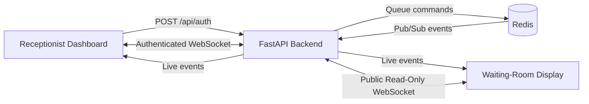

# Real-Time Queue Management System (RQMS)

RQMS is a real-time patient queue management application for clinics and consultation centers. It gives reception staff a protected dashboard for registering and calling patients, while a separate waiting-room display shows the active token, upcoming tokens, and estimated waiting times.

The application uses Redis as both its queue data store and Pub/Sub message broker. Queue changes are broadcast through a FastAPI WebSocket server, allowing every connected screen to update immediately without polling or refreshing the page.

## Key Features

- **Live queue synchronization** across receptionist and waiting-room screens
- **Protected receptionist access** using a staff passphrase, a 12-hour JWT, and backend token verification
- **Remembered staff sessions** using `localStorage`, with invalid or expired tokens cleared automatically
- **Patient registration** with an automatically generated queue token
- **FIFO queue processing** for calling patients in arrival order
- **Consultation tracking** with rolling average service-time metrics
- **Dynamic wait estimates** based on queue position and average consultation time
- **Public waiting-room display** with active-token alerts and connection status
- **Redis-backed state** with Pub/Sub broadcasting and 24-hour patient record expiry
- **Responsive interface** built for desktop dashboards and large displays

## Application Views

| View | URL | Purpose | Access |
| --- | --- | --- | --- |
| Receptionist dashboard | `http://localhost:3000/ReceptionistView` | Authenticate staff, register patients, call the next token, and end consultations | Staff passphrase required |
| Waiting-room display | `http://localhost:3000/PatientWaitingRoomView` | Show the current token, upcoming queue, live wait estimates, and connection status | Public/read-only |
| API documentation | `http://localhost:8000/docs` | Inspect and test the FastAPI HTTP endpoint | Local development |

> The root frontend route (`/`) is currently blank. Open one of the application views listed above.

## Architecture



### Event Flow

1. Reception staff authenticate with the configured passphrase.
2. FastAPI returns a JWT that is valid for 12 hours.
3. The frontend stores the token in `localStorage` so staff do not need to re-enter the passphrase on every page reload.
4. On future visits, the frontend sends the stored token to FastAPI for verification before unlocking the receptionist dashboard.
5. The frontend opens a WebSocket connection and requests the current queue.
6. Authorized staff actions update the Redis queue and patient records.
7. Redis publishes an event on `channel:updates`.
8. FastAPI forwards the event to every connected WebSocket client.
9. Zustand updates the shared frontend state and React redraws each view.

### Authentication Flow

The receptionist dashboard does not trust a token just because it exists in browser storage. A user can edit `localStorage` manually, so the frontend validates stored tokens with the backend before showing staff controls.

1. A staff member submits the passphrase to `POST /api/auth`.
2. FastAPI checks the passphrase and signs a JWT containing `role: "receptionist"` and a 12-hour expiration.
3. The frontend saves that JWT as `ws_auth_token` in `localStorage`.
4. When the receptionist page loads again, it calls `POST /api/auth/verify` with the stored token.
5. FastAPI verifies the JWT signature, expiration, and receptionist role using `JWT_SECRET`.
6. If verification succeeds, the dashboard opens and connects the WebSocket with that token.
7. If verification fails, the frontend removes `ws_auth_token` and shows the login form again.

## Technology Stack

| Layer | Technology |
| --- | --- |
| Frontend | Next.js 16, React 19, TypeScript |
| Styling | Tailwind CSS 4 |
| Client state | Zustand 5 |
| Icons | Lucide React |
| Backend | FastAPI, Python |
| Authentication | PyJWT |
| Data store | Redis |
| Real-time transport | WebSockets and Redis Pub/Sub |

## Project Structure

```text
RQMS/
|-- backend/
|   |-- main.py                 # FastAPI routes, authentication, and WebSocket server
|   |-- redisQueue.py           # Redis queue operations, metrics, and event publishing
|   |-- .env                    # Backend secrets (not committed)
|   `-- .gitignore
|-- frontend/
|   |-- app/
|   |   |-- ReceptionistView/   # Protected staff dashboard and route
|   |   |-- PatientWaitingRoomView/ # Public queue display and route
|   |   |-- stores/             # Zustand store and React provider
|   |   |-- utils/websocket.ts  # Authentication and WebSocket client
|   |   |-- globals.css
|   |   |-- layout.tsx
|   |   `-- page.tsx
|   |-- public/
|   |-- package.json
|   `-- next.config.ts
`-- readme.md
```

## Prerequisites

Install the following before running the project:

- [Node.js](https://nodejs.org/) 20.9 or newer
- [Python](https://www.python.org/) 3.10 or newer
- [Redis](https://redis.io/docs/latest/operate/oss_and_stack/install/install-redis/) available at `localhost:6379`
- npm, included with Node.js

On Windows, Redis can be run through WSL, Docker, or another Redis-compatible local service. The current backend connects directly to `redis://localhost:6379`.

## Local Setup

### 1. Clone the repository

```bash
git clone <repository-url>
cd RQMS
```

### 2. Start Redis

If Redis is installed locally:

```bash
redis-server
```

Alternatively, start an isolated Redis container:

```bash
docker run --name rqms-redis -p 6379:6379 -d redis:7-alpine
```

Confirm that Redis is reachable:

```bash
redis-cli ping
```

The expected response is `PONG`.

### 3. Configure and start the backend

Create a virtual environment from the `backend` directory:

```bash
cd backend
python -m venv .venv
```

Activate it on macOS or Linux:

```bash
source .venv/bin/activate
```

Activate it in Windows PowerShell:

```powershell
.\.venv\Scripts\Activate.ps1
```

Install the backend dependencies:

```bash
pip install -r requirements.txt
```

Create `backend/.env` with the following values:

```dotenv
STAFF_PASSPHRASE=replace-with-a-secure-staff-passphrase
JWT_SECRET=replace-with-a-long-random-secret
ALGORITHM=HS256
```

Generate a suitable JWT secret with Python:

```bash
python -c "import secrets; print(secrets.token_urlsafe(48))"
```

Start FastAPI from the `backend` directory:

```bash
uvicorn main:app --reload --host 0.0.0.0 --port 8000
```

### 4. Install and start the frontend

Open another terminal:

```bash
cd frontend
npm install
npm run dev
```

The frontend runs at `http://localhost:3000` and connects to the backend at `http://localhost:8000`.

### 5. Open the application

1. Open `http://localhost:3000/ReceptionistView` at the reception desk.
2. Sign in using the value configured as `STAFF_PASSPHRASE`.
3. Open `http://localhost:3000/PatientWaitingRoomView` on the public display.
4. Register a patient and confirm that both screens update in real time.

## Configuration

### Backend environment variables

| Variable | Required | Description | Example |
| --- | --- | --- | --- |
| `STAFF_PASSPHRASE` | Yes | Shared passphrase used to authorize reception staff | `change-me` |
| `JWT_SECRET` | Yes | Secret used to sign and verify staff tokens | A long random string |
| `ALGORITHM` | Yes | JWT signing algorithm | `HS256` |

The frontend currently contains fixed development URLs in `frontend/app/utils/websocket.ts`:

- HTTP API: `https://rqms-backend.onrender.com`
- WebSocket API: `wss://rqms-backend.onrender.com/ws`

Update these values, or move them to public environment variables, when switching between local development and deployed environments.

## Usage

### Receptionist workflow

1. Enter the staff passphrase to establish an authenticated WebSocket connection.
2. Register a patient using their ID, full name, and age.
3. The system assigns the next zero-padded token, such as `001`.
4. Select **Call Next Patient** to remove the first patient from the waiting queue and display their token.
5. Select **End Consultation** after the appointment to complete the patient record and update the average consultation time.

### Waiting-room workflow

The public display connects without a staff token and can only request and receive queue information. It shows:

- The token currently called to the consultation room
- The number and order of tokens still waiting
- Estimated wait time for each queued token
- The current average service pace
- Live WebSocket connection status

## API and WebSocket Reference

### HTTP authentication

`POST /api/auth`

Request:

```json
{
  "password": "staff-passphrase"
}
```

Successful response:

```json
{
  "success": true,
  "token": "<jwt>"
}
```

The JWT contains the `receptionist` role and expires after 12 hours.

`POST /api/auth/verify`

Request:

```json
{
  "token": "<jwt>"
}
```

Successful response:

```json
{
  "success": true
}
```

This endpoint verifies that the token was signed by the backend, has not expired, and contains the `receptionist` role. Invalid, expired, missing, or user-edited tokens return `{"success": false}`.

### WebSocket connection

```text
ws://localhost:8000/ws?token=<jwt>
```

The token is optional for public clients. Without a valid receptionist token, write commands return an `UNAUTHORIZED` event.

### Client commands

| Action | Access | Payload fields | Description |
| --- | --- | --- | --- |
| `GET_INITIAL_QUEUE` | Public | None | Broadcast the current waiting queue |
| `ADD_PATIENT` | Receptionist | `patient_id`, `name`, `age` | Register and enqueue a patient |
| `CALL_NEXT_PATIENT` | Receptionist | None | Call the first patient in the FIFO queue |
| `END_CONSULTATION` | Receptionist | `patient_id` | Complete the active consultation and update metrics |

Example command:

```json
{
  "action": "ADD_PATIENT",
  "patient_id": "PAT-1001",
  "name": "Aarav Sharma",
  "age": 34
}
```

### Server events

| Event | Meaning |
| --- | --- |
| `INITIAL_QUEUE` | Initial queue snapshot requested by a client |
| `PATIENT_ADDED` | A patient was registered and appended to the queue |
| `TOKEN_CHANGED` | The next patient was called |
| `METRICS_UPDATED` | A consultation ended and the rolling average changed |
| `QUEUE_EMPTY` | A call-next request found no waiting patients |
| `UNAUTHORIZED` | A public or invalid client attempted a protected action |

## Redis Data Model

| Key | Type | Purpose |
| --- | --- | --- |
| `patient_queue` | List | Ordered patient IDs waiting to be called |
| `patient:<id>` | Hash | Patient details, token, status, and timestamps |
| `counter:daily_tokens` | String/integer | Source for sequential token numbers |
| `queue:metrics` | Hash | Current token, average time, and patients-seen count |
| `queue:metrics:active_patient_id` | String | ID of the patient currently being served |
| `queue:metrics:durations` | List | Recorded service-duration values |
| `channel:updates` | Pub/Sub channel | Real-time queue and metric events |

Patient hashes expire after 24 hours. Other queue and metric keys currently persist until Redis data is cleared; despite its name, `counter:daily_tokens` is not automatically reset each day.

## Available Frontend Commands

Run these commands from `frontend/`:

| Command | Description |
| --- | --- |
| `npm run dev` | Start the Next.js development server |
| `npm run build` | Create an optimized production build |
| `npm run start` | Run the production build |
| `npm run lint` | Run ESLint |
